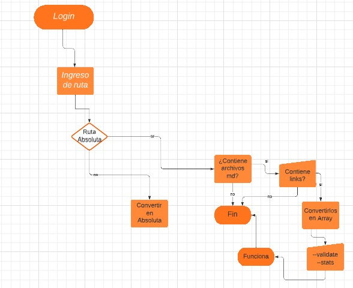
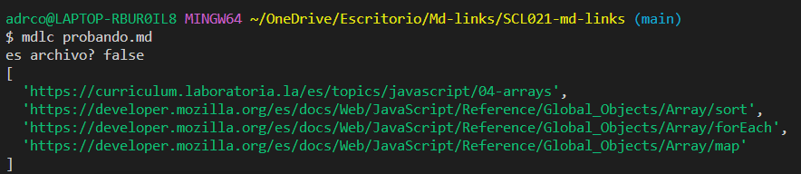
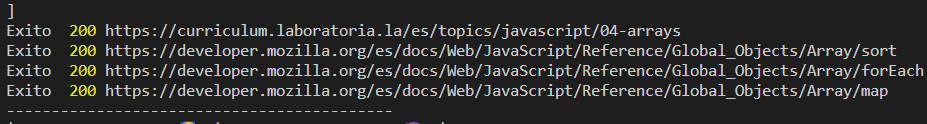
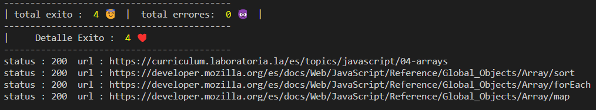
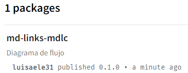

1. ***Definición del Proyecto:***

Que es Markdown es un lenguaje de marcado que facilita la aplicación de formato a un texto empleando una serie de caracteres de una forma especial. El cuál fue pensado para elaborar textos cuyo destino iba a ser la web con más rapidez y sencillez que si estuviésemos empleando directamente HTML. Y si bien ese suele ser el mejor uso que podemos darle, también podemos emplearlo para cualquier tipo de texto, independientemente de cual vaya a ser su destino.

2. ***Resumen del producto:***

Markdown es muy utilizado en plataformas como GitHub, foros, blogs como también para crear documentación y es muy común encontrar varios archivos en ese formato en cualquier tipo de repositorio. Estos archivos Markdown normalmente contienen links (vínculos/ligas) que muchas veces están rotos o ya no son válidos y eso perjudica mucho el valor de la información que se quiere compartir. Dentro de una comunidad de código abierto, nos han propuesto crear una herramienta usando Node.js, que permite al usuario recorrer un directorio, filtrar los archivos en formato Markdown y extraer los links que contengan para verificar su estado: sin conexión, útiles o rotos y dar algunas estadísticas que se imprimirán en consola como la cantidad de links, el estado de los links y los links únicos.

3. ***Diagrama de Flujo:*** 

4. ***Instrucciones de instalación y uso:***

* Debes tener instalado node.js y npm.

* Para instalar mi librería:
  npm install mdlc.

* Importa la librería en tu proyecto:
  const nombreLibreria = require('md-links').

* Uso de la librería:
  Opción 1: Muestra los links extraidos del archivo con extensión .md que ingreses node tuArchivo.js tuArchivo.md.

  Opción 2: Muestra la validación de links del archivo con extensión .md que ingreses node archivo.js tuArchivo.md -v | node archivo.js tuArchivo.md --validate.

  Opción 3: Muestra estadísticas del archivo con extensión .md que ingreses: Links totales | Links exitosos, y Links con errores.

5. ***Ejemplos como aparece en la consola:***

